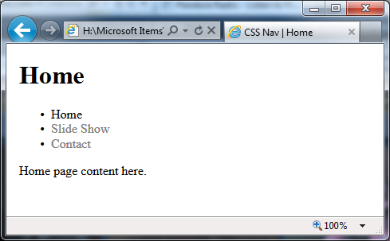

# My First Web Page

## Background

### HTML

Ahh... The internet.

> 
>
> Look at them all having fun! Rad!

Yes... But what makes up all the amazing pages we know and love? **HTML**.

**HTML** stands for HyperText Markup Language. If you have every heard of hyperlinks in word docs, this usage of hyper may make some sense. What HyperText in **HTML** means it's a language that ultimate links content (text) together! Basically, **HTML** constructs the skeleton of a website; a title should go here, some text should go here, an image here, etc. In fact, what you're looking at right now is... (drumroll)... **HTML**!

There are so many different tags in **HTML** that dictate what will be on a user's screen. However, if you've ever seen a website that is pure HTML...

> 
>
> Beauty in simplicity?

It's pretty spartan. We can make our pages more interesting and visually appealing by styling them! Guess what, there's a language for that too! It's called **CSS**.

### CSS

**CSS** stands for Cascading Style Sheets. It's a fancy way of describing the way that **CSS** works in a top down flow. Basically, **CSS** styles the **HTML** by assigning style atributes to the different **HTML** tags. No worries about the gritty details of what that means right now, but we'll see soon enough! The result can make websites that look like the very retro [website for Space Jam](https://www.warnerbros.com/archive/spacejam/movie/jam.htm) or like the professional [website for NPR](https://www.npr.org/).

### Resources

It turns out, one of the best resources for trying to figure out how to make webpages is the internet! For **HTML/CSS**, I suggest using [W3Schools](https://www.w3schools.com/). You can find info on all kinds of **HTML** tags and how to use them, as well as what styling options exist for **CSS**!

## Your Mission

Locally (on your computer), make two a folder called `myfirstwebpage`, and create two files in it. One called `index.html` and one called `styles.css`. One will contain the skeleton of your site, the other, the styles! With these two files, let's create a webpage of your choosing using **html** and **css** that has the following:

1. At least one `
` that has either an `id` or `class`
2. Two different font sizes
3. At least one heading (`h1`, `h2`, etc.)
4. At least one `<a/>` tag linking to another site (using `href`)
5. At least one image using the `` tag
6. At least one ordered or unordered list (`<ol>` or `<ul>`) with several list items (`<li>`)
7. Style in a separate `styles.css` file

Feel free to add more to this website! These are just minimum requirements.

If unsure about what to make, here are some possibilities:

- A webpage dedicated to your favorite celebrity, sports team, or musical artist
- A webpage introducting yourself to the world
- A webpage dedicated to a hobby of yours

## Submission

Be sure you're in the 2_PM directory and add, commit, and push both the `index.html` abd `styles.css` files using git (Remember how?).
